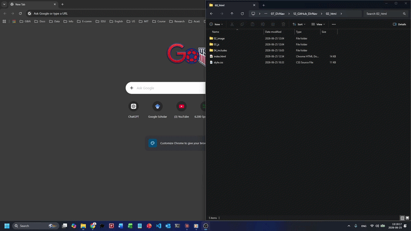

DirNav
============================================================

One JSON file, one click, every folder and url and file for a project opens at once. DirNav is a local dashboard that turns a single `projects.json` manifest into a static page, and routes each click through a custom `kickoff://` URI to a PowerShell runner that opens the right things on your machine.

<!--  -->



Try the [live demo](https://edchen1240.github.io/DirNav/). Browse-only, since Kickoff and Open P00 require the local Windows install.

Windows 10 and 11. MIT licensed.


# Why this exists

## The Problem
1. 🤯 A user usually manages 10 to 20 active projects on their computer, ranging from work to personal, learning to hobby, and research to side projects.
2. 🎯 The user knows their projects and can roughly compare priorities between them. Even so, it is hard to keep track of all of them.
3. 📚 Each project has its own folders, urls, and files that the user needs to open to work on it.
4. 🔍 Locating and opening all the related folders, urls, and files for a project takes time and attention, and the user might forget some of them, or open the wrong one.
5. 🫠 After a long pause on a project, the user might forget where the related folders are, lose time searching for them, and feel friction starting work again.

## Solution and Features
DirNav is a local dashboard that turns a single `projects.json` manifest into a static page, and routes each click through a custom `kickoff://` URI to a PowerShell runner that opens the right things on your machine. It addresses the five problems above as follows:

1. 🏷️ Each project can carry multiple attributes. For example, a personal coding project for stock market analysis can have the attributes `personal`, `coding`, and `finance`. Filter projects by attribute to find the one you want to work on quickly.
2. 🚩 Each project has a priority from 0 to 10, adjustable at any time. The dashboard sorts projects by priority so the most important one surfaces first.
3. 📝 `projects.json` records every folder, url, and file of a project, so nothing is forgotten even when things are scattered across different folders or online services.
4. ⚙️ The Kickoff button opens every folder, url, and file of a project in one click. Check or uncheck individual items to open only a subset.
5. ➡️ We encourage each project to have a `P00` progress log. Write an overview, then after each work session note what was done and what to do next. This makes it easy to pick up again after a long pause.


# How it works

```
projects.json  ->  Python generator  ->  static HTML dashboard
                                                    |
                                                    | click Kickoff
                                                    v
                                       kickoff://open?slug=...&items=...
                                                    |
                                       Windows custom URI scheme
                                                    v
                                              kickoff.ps1
                                                    |
                                                    v
              folders open as Explorer tabs, urls and files via Start-Process
```

The interesting piece is the `kickoff://` URI scheme. A browser cannot normally launch local programs, for good reason. Registering a custom URI scheme with the OS gives the page exactly one well-defined call site into PowerShell. The dashboard emits `kickoff://open?slug=<projectSlug>&items=<index-list>`. The runner resolves the slug against `projects.json`, never executes raw paths from the URL, and only opens entries the manifest already approved.

The page is the UI. The manifest is the trust boundary. PowerShell does the work.


# Features

- Single source of truth: every project, folder, url, file, path to project log file (P00, can be md, txt, or excel), attribute, priority, status, and date lives in `projects.json`. Edit, recompile, done.
- Fuzzy global finder across every folder, url, file, and P00 path in every project.
- Attribute filter chips with per-tag colors. Add an attribute by editing one line in the manifest.
- Status pool with dim flags. `paused`, `stalled`, and `completed` projects render dimmed automatically.
- Grouped grid. Cards group by primary attribute, the highest-priority group on top, ordered by priority within each group. Low-priority and unset cards drop into a parked band at the bottom.
- One-click batch open. The Kickoff button opens every checked folder as an Explorer tab, then the urls, then the files. Uncheck items to open only a subset.
- Open P00 button. Opens the project's P00 markdown in VSCode. Ctrl plus click opens its folder in Explorer instead.
- Validated at compile time. The generator checks attribute-pool membership, unique slugs, date formats, and related-link symmetry. A broken `projects.json` prints an error instead of writing a broken page.


# Quick start

Requirements: Windows 10 or 11, Python 3.x on PATH, PowerShell (built in), VSCode (only if you want the Open P00 button). No pip install needed, the generator uses standard library only.

All internal paths are resolved at install time. The only file you edit by hand is `projects.json` (the project entries themselves).

1. Clone the repo. Copy `projects.example.json` to `projects.json` and edit it to point at your own folders.
2. Run `[B]_1-Install Protocol.bat` once. Registers the `kickoff://` protocol under your Windows user (HKCU). Re-run if you ever move the repo. Fully restart your browser after the first install so it picks up the new scheme.
3. Run `[B]_2-Compile Dashboard.bat` after every edit to `projects.json`. Validates the manifest, then regenerates `02_html/index.html`.
4. Run `[B]_localhost homepage.bat` (or `python -m http.server 5599` from `02_html/`) to serve the dashboard, then open `http://localhost:5599` in your browser. Keep the server running while using DirNav.

The first Kickoff click prompts you once to allow PowerShell. That is Windows confirming the custom protocol, not the script asking for elevation.


# Repo layout

```
01_scripts/             P01_generate DirNav page.py, kickoff.ps1, Install-Protocol.ps1
02_html/                generated index.html, style.css, 03_js/app.js, 04_includes/
projects.example.json   sanitized sample manifest
[B]_1-Install Protocol.bat
[B]_2-Compile Dashboard.bat
[B]_localhost homepage.bat
README.md
LICENSE
```


# Design notes

- The manifest is the trust boundary. The browser never sends paths to PowerShell. It sends a slug and an index list. The runner re-resolves both against `projects.json`. The set of openable things is exactly the set the user has already curated.
- The page is the UI. The runner is the worker. They communicate through one well-defined message: `kickoff://open?slug=...&items=...`. No other entry point from the browser into the shell.
- Tab orchestration uses SendKeys against Explorer. Not elegant, but as of Windows 11 it is the only reliable way to open multiple folders as tabs in the same window.
- Colors are CSS variables in one place. Edit `--attr-<name>` in `style.css :root` to recolor a tag. Add `--attr-<name>-font` to override the label text color when the background clashes with white (used for the yellow `music` tag).
- The compiled `02_html/index.html` is generated. Do not hand-edit it. Edit `projects.json`, then recompile.


# Scope and limits

- Windows only. The browser-to-shell URI bridge, the Explorer tab orchestration, and the path conventions are Windows-specific by design. No plan to port to macOS or Linux.
- Single user. No multi-user state, no sync, no auth. `projects.json` is your file.
- A productivity tool, not a product. Use it, fork it, or just steal the `kickoff://` pattern for your own thing.


# Data format

`projects.json` is a JSON object with four top-level keys: `schemaVersion`, `attributePool`, `statusPool`, and `projects`.

```json
{
  "schemaVersion": 1,
  "attributePool": ["coding", "career", "venture", "learning", "music", "personal"],
  "statusPool": [ { "value": "active", "label": "Active", "description": "...", "dim": false, "order": 1 } ],
  "projects": [ ]
}
```

- `schemaVersion`: integer. Bump when the field set changes so the generator and validator can migrate older files. Currently `1`.
- `attributePool`: the controlled, ordered vocabulary of attribute tags. A project's `attributes` may only contain values from this pool. The order here is the order tags appear (e.g. as filter chips) in the navigator. List them in priority order, not alphabetically. Edit this one line to add, rename, or reorder tags.
- `statusPool`: the controlled, ordered vocabulary of statuses. Each entry has `value`, `label`, `description`, `dim`, and `order`. A project's `status` must equal one of these `value`s. `dim` true means the navigator renders that project dimmed (currently `paused`, `stalled`, `completed`).
- `projects`: array of project objects, each using the field order below.

## Project fields

Use this order for each project object. Every project should include every field. Use `""` for empty strings (`note`, unset dates), `[]` for empty arrays (`attributes`, `folders`, `urls`, `files`, `related`), and `null` for an unset `priority`.

1. `projectSlug`: short unique identifier. URL-safe, no spaces. Stable, since renaming breaks the kickoff name, the `kickoff://` link, and any cross-reference.
2. `projectName`: human-readable name shown in the navigator.
3. `attributes`: array of tags from `attributePool`. The first tag is the project's primary attribute and decides which group the card lands in.
4. `priority`: integer 0 to 10, or `null` if unset. Suggested scale: 0 to 2 stalled or parked, 3 to 5 side projects, 6 to 7 main work, 8 to 10 top priority. Used to sort within a filter.
5. `status`: one of `active`, `evolving`, `waiting`, `paused`, `stalled`, `completed`. See below.
6. `p00InitiationDate`: date this project began being tracked with a P00 file, `YYYY-MM-DD`.
7. `startDate`: date the project itself began, `YYYY-MM-DD`, or `""` if unset.
8. `lastWorkDate`: most recent known work date, `YYYY-MM-DD`, or `""` if unset.
9. `note`: short context note for relationships, status, or caveats. `""` when empty.
10. `folders`: array of absolute Windows folder paths. Opened as Explorer tabs by the runner. The first opens in a new window, the rest as tabs, in array order.
11. `urls`: array of web urls (Overleaf, Claude projects, websites, order/status pages). A single web url on the dashboard opens directly in a new browser tab. In a batch Kickoff it opens via `Start-Process`.
12. `files`: array of absolute Windows file paths (launchers, spreadsheets, decks, key documents). Each opens in its default app via `Start-Process`.
13. `related`: array of other `projectSlug` values this project relates to. Keep both directions in sync. A parent lists its children, each child lists the parent.
14. `p00`: absolute Windows path to the project's P00 markdown file.

## Status values

- `active`: in the current focus, being worked on now. Has an ending goal or milestone.
- `evolving`: a long-lived project with no fixed end, worked on intermittently as it grows. Differs from `active`, which is a focused push.
- `waiting`: blocked on something external (a person, a decision, a service). Cannot proceed until it resolves.
- `paused`: deliberately set aside; not blocked, resumable any time.
- `stalled`: unintentionally inactive for a long time, usually due to limited time, attention, or money. Drifted rather than decided.
- `completed`: done. No further work expected.

## Path rules

- Use absolute Windows paths.
- Escape backslashes as `\\` because this is JSON.
- Keep urls in `urls`, local files in `files`, local directories in `folders`.
- No duplicate urls or paths within a project.

## Example project

```json
{
    "projectSlug": "ProjectAlpha",
    "projectName": "Project Alpha",
    "attributes": ["coding", "learning"],
    "priority": 8,
    "status": "active",
    "p00InitiationDate": "2026-01-15",
    "startDate": "2025-09-01",
    "lastWorkDate": "2026-06-20",
    "note": "Primary coding project; notebooks plus a small dataset.",
    "folders": [
        "C:\\Users\\you\\Projects\\ProjectAlpha",
        "C:\\Users\\you\\Projects\\ProjectAlpha\\notebooks",
        "C:\\Users\\you\\Projects\\ProjectAlpha\\data"
    ],
    "urls": [
        "https://www.overleaf.com/project/exampleProjectId"
    ],
    "files": [
        "C:\\Users\\you\\Projects\\ProjectAlpha\\Launch.bat"
    ],
    "related": ["ProjectBeta"],
    "p00": "C:\\Users\\you\\Projects\\ProjectAlpha\\P00_ProjectAlpha.md"
}
```


# Dashboard reference

The header has the logo, the global finder, the attribute filter chips, a Hide parked toggle, and a Reset button. Each chip is colored from `--attr-<name>` in `style.css`. Click a chip to filter by that attribute. Click Reset to clear chips and search, and re-check every per-item checkbox.

Below the header, cards group by primary attribute. The highest-priority group lands on top, cards inside each group are ordered by priority descending. Projects with priority below 2 (or unset) drop into a single Low priority / parked band at the bottom regardless of attribute. Dim-flagged statuses render dimmed.

A card shows:
- Project name in the title row.
- A row of attribute tags, colored per attribute.
- A meta row of `projectSlug | priority | status`.
- The three dates, with `lastWorkDate` brighter and bolder than the other two.
- Two buttons: Kickoff (opens the items currently checked; with everything checked, opens folders as Explorer tabs followed by urls and files) and Open P00 (opens the P00 file in VSCode, Ctrl plus click opens the P00 folder in Explorer).
- Three sections (Folders, URLs, Files), each item with a checkbox (all checked by default) and a clickable label. A single folder or file goes through `kickoff.ps1`. A single web url opens directly in a new browser tab.
- A `related` line of clickable slugs that jump to the related card.


# License

MIT. See `LICENSE`.
